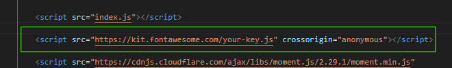
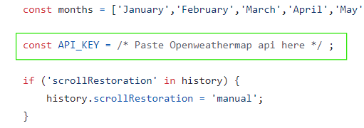
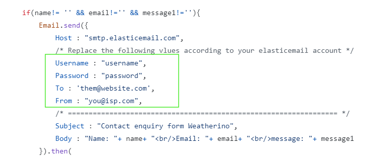
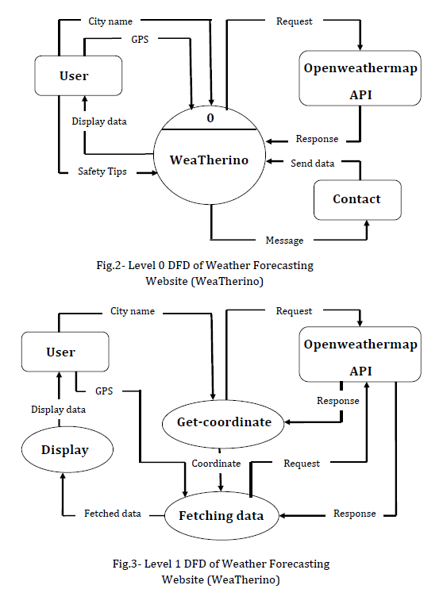
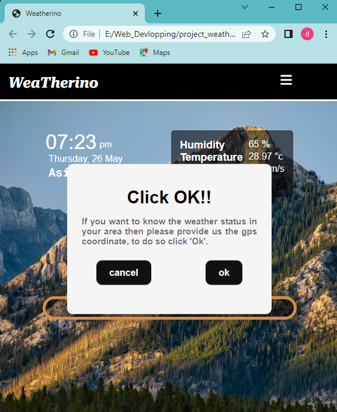
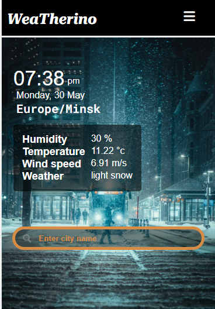
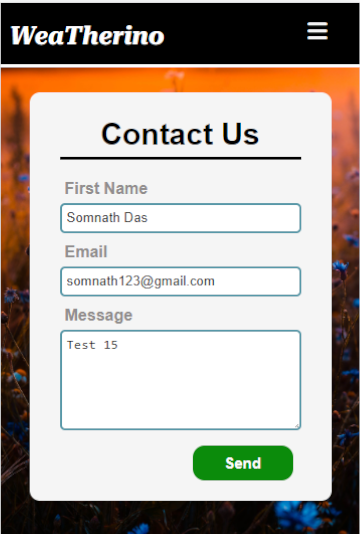
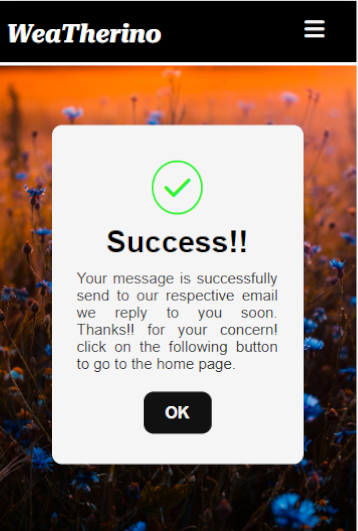
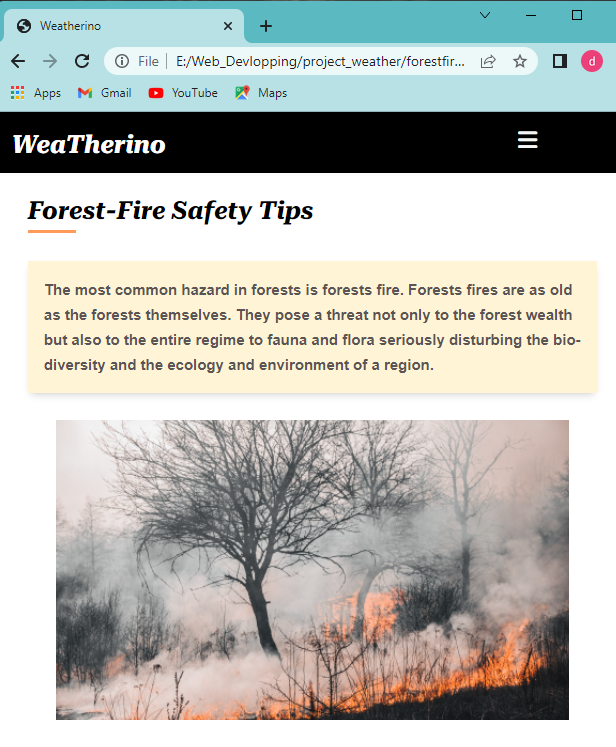

Weatherino

It's a weather forecasting website. It has two features, the user can get the weather info by using GPS locations or by entering the name of the location. The website also provides some safety tips.


## Table of contents

- [Steps to run the project properly](#steps-to-run-the-project-properly)
- [DFD of the project](#dfd-of-the-project)
- [Screenshots of the project](#screenshots-of-the-project)
## Steps to run the project properly

*Note: Before cloning the project you need to create an account in [elasticemail.com](https://elasticemail.com/) (For sending messages from the contact section), Openweathermap.org (For getting the weather info), [fontawesome.com](https://fontawesome.com/start) (For Icons ).

Now folow the steps mentioned below-
- clone the repositery
```bash
    git clone https://github.com/Aritra212/WeaTherino.git
```

- add fontawesome script at the end of body tag in each HTML file
  
  

- open the index.js file and change the API key according to your Openweathermap account
  
  

- open the contact.html file and change the Emil.send() function according to your elelasticmail details.
  
  

- Now run the index file in your browser.


## DFD of the Project

 

 Open the pptx file(project_ppt1) to get a brief idea about the project

## Screenshots of the project

- ### Home page desktop view
  
  

- ### Home page Mobile view

  

- ### Contact page
  
  
  

- ### Safety tips page
  
  
